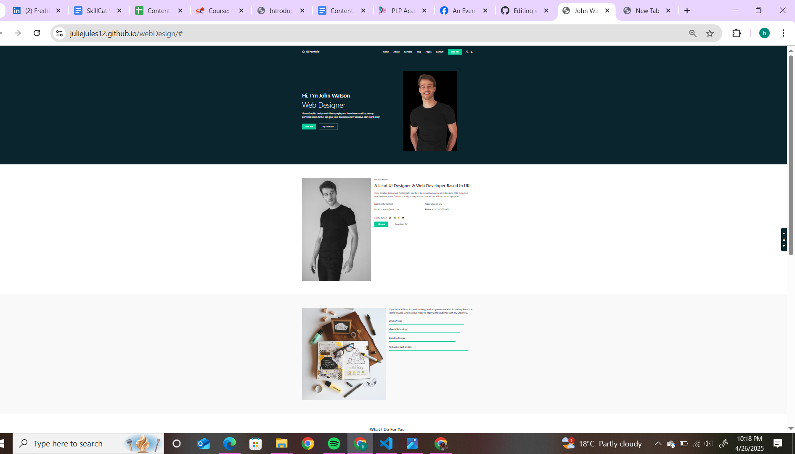

# Portfolio Website

**Group 276** - Portfolio Website Project  
*Created by Julieta Yes and Team Members*

---

## 📚 Overview

This project is a responsive portfolio website built using HTML, CSS, and Bootstrap.  
The website showcases skills, services, portfolio work, and a contact section.

---

## 🛠️ Solution Approach

- Designed a clean, modern layout.
- Used Bootstrap for mobile responsiveness.
- Divided tasks among team members for smooth collaboration.

---

## 🌟 Features

- Responsive Design
- Navigation Bar
- About Section
- Services Section
- Skills with Progress Bars
- Portfolio Gallery
- Contact Form
- Footer

---

## 📸 Demo Screenshot



---

## 🌐 Live Demo

👉 [View Website](https://juliejules12.github.io/webDesign/)

---

## 🤝 Team Members

- Julieta Yes
- [Team Member 2]
- [Team Member 3]

---

## 🚀 How to Run Locally

```bash
git clone https://github.com/juliejules12/webDesign.git
